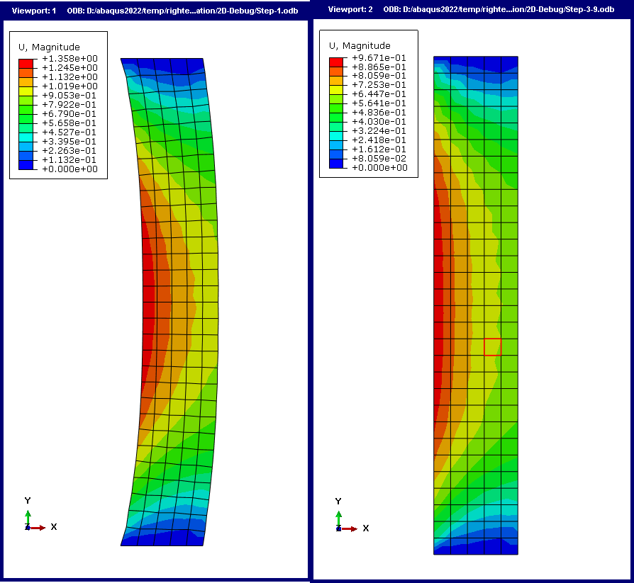

# How to prepare all necessary files and implement the modification procedure.

Bio-tissue is often in a certain state of pre-stress in the human body, for example, the cornea is under intraocular pressure, the blood vessel is under blood pressure and et al. So whatever method we use to measure the configuration of the tissue, we can not get the load-free configuration(or be called initial configuration), which is needed in abaqus modeling.

In this project, we use the direct method to obtain the initial configuration. Assume that we have a target configuration $A$ and a known load $F$. Then we start a simple iterative process:
1.  Start with our only known target configuration $A$ as initial configuration $A_0$
2.  Apply load $F$ to $A_0$, and get the result configuration $A^*$
3.  Calculate the difference between $A^{\*}$ and the target configuration $A$, to get the difference field $U=A^{\*}-A$
4.  Check if the difference field $U$ is small enough, if yes, then stop the iteration and $A_0$ is the result of  initial configuration; if not, then update the initial configuration $A_0$ by $A_0 = A_0 - U$ and go back to step 2.

In this project, we use a internal pressure loaded cylinder as an example of the direct method. You can simply replace the example job file to your own one, the code still works. You should refer to different folders regarding to the dimension of your model, 2D or 3D.

## Whole process of the modification procedure

`main_program.py` is the main program, `IdentifyInitialConfiguration.py` is a module for defined functions, `Step-1.inp`, `Step-2.inp` and `GenerateStep-3.py` are files you should prepare based on your job file. The code interpretation for the program is as follows:
1. `main_program.py` opens a powershell to submit `Step-1.inp` to abaqus
2. After the calculation is complete, read the initial coordinates and displacement field of the node set `allnodes`, save as `initial_X0` and `dis_data` respectively.
3. Implement `-dis_data` to `Step-2.inp` and submit to abaqus.
4. After the calculation is done, `main_program.py` calls `GenerateStep3.py` to generate `Step-3.inp` based on the deformed shape of `Step-2`, and submit to abaqus.
5. After `Step-3` is complete, read the initial coordinates and displacement field of the nodeset `allnodes`. Check if the deformed shape meet the requirements of the tolerance. 
6. If not, recalculate the displacement that should be implement to `Step-2` and go to `3.`.
7. If so, the procedure is done and `Step-3.inp` is the model with pre-stress that we wanted.

## Prepare the input files

Here we introduce how to the needed files based on your job.
1. Prepare `Step-1.inp` 
	- First, after you have complete your own abaqus job file, you need to select all the nodes that are not fixed(all nodes in the model except the nodes of the fixed boundary) and create a nodeset named `allnodes`.
	- Then you can write the `.inp` file of your job, and save it as `Step-1.inp` in your abaqus working directory.
	- You need to add the following code to the end of your `.inp` file before the line of `*End Step`:
	```
	    *node print, nset=allnodes
	    U
	```

2. Prepare `Step-2.inp`
	- Everything is the same as your own job file, except the load section. You should remove your force load $F$ , and add a displacement load to `allnodes`, which is based on a user subroutine DISP (remember to tick the boxes before `U1` , `U2`, `U3`,  which means they would be passed to the user subroutine; you don't need to write a DISP by yourself, the DISP file will be automatically generated by the program).
	- Write `.inp` file for the job and save it as `Step-2.inp` 

3. Prepare `GenerateStep3.py`
	- Submit `Step-1` and wait for completion.
	- Open a new model database in abaqus, open `PythonReader.exe` to record your python code of modeling process.
	- Click `File > Import > Part` to import deformed shape from `Step-1.odb` as a new meshed part.
	- Set material parameters, boundary conditions and stuff same as what you have done when creating `Step-1.inp`.
	- After you have writen imput file, copy all the code in the window of `PythonReader.exe` to `GenerateStep3.py`. Here you've got a python file which can reproduce your job file.
	- At the beginning of the  `.py` file, add the following code:
	```python
	import os
	import time
	with open('Step3_loop.txt','r') as f:
	    status_code = int(f.read())
	new_Step3_filename = 'Step-3-' + str(status_code)
	f.close()
	main_folder = r"D:\abaqus2022\temp\righteye\Search-Initial-Configuration"  # set your own working directory
	Step2_name = 'Step-2-' + str(status_code) + '.odb'
	os.chdir(main_folder)
	```
	- Change the odb name in `openOdb[]`  as follows:
	```python
	session.openOdb(os.path.join(main_folder,Step2_name))
	odb = session.odbs[Step2_name]
	```
	- Change the job name as follows:
	```python
	mdb.Job(name=new_Step3_filename, model='Model-1', description='', type=ANALYSIS,
	    atTime=None, waitMinutes=0, waitHours=0, queue=None, memory=90,
	    memoryUnits=PERCENTAGE, getMemoryFromAnalysis=True,
	    explicitPrecision=SINGLE, nodalOutputPrecision=SINGLE, echoPrint=OFF,
	    modelPrint=OFF, contactPrint=OFF, historyPrint=OFF, userSubroutine='',
	    scratch='', resultsFormat=ODB, numThreadsPerMpiProcess=1,
	    multiprocessingMode=DEFAULT, numCpus=8, numDomains=8, numGPUs=0)
	mdb.jobs[new_Step3_filename].writeInput(consistencyChecking=OFF)
	```
	- At the end of the python file, add the following code:
	```python
	# flag for .py file completion
	step3_status = 1
	step3_status_filename = 'step3.txt'
	with open(step3_status_filename,'w') as step3_status_file:
	    step3_status_file.writelines(str(step3_status))
	step3_status_file.close()
	```

These are all the files you need to prepare based on your own model. 

## Changes to be made when you use your own job file

- In the code file `IdentifyInitialConfiguration.py`, you need to change the `*Part, name=cylinder` in line 157 to your own part name.
- In the code file `main_program.py` and `GenerateStep3_2.py`, you need to change the variable `main_folder` to your own working directory.

After these changes are made, you can move all the five files to your working directory and run `main_program.py` in any python compiler and wait for success!

## Example results


The figure above is an example of 2D model. The left and the right represent the loaded configuration before and after the modification procedure, respectively.

## Troubleshooting

- When the main program encounters an error, before you fix the bugs and restart the program, remember to delete all the result files of abaqus in your working directory. If you don't do that, the powershell called by the main program would halt, because it would ask `Old job files exist. Overwrite? (y/n):` and you have no way to answer.
